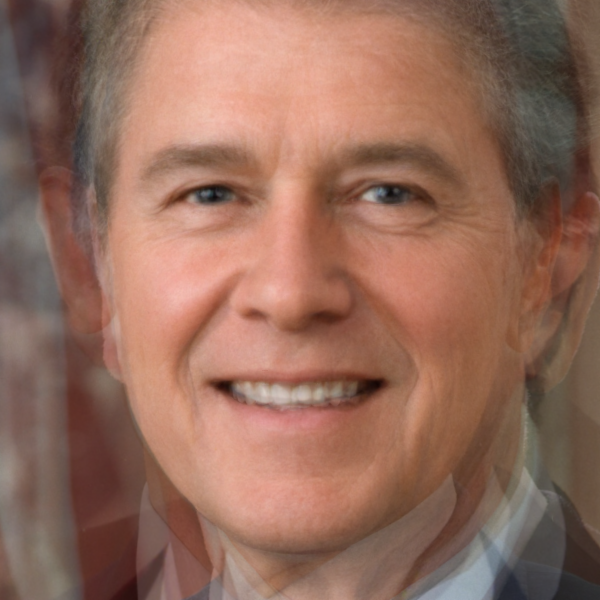

# 平均脸合成
将多张人脸照片合成一张平均脸(大众脸)

## 效果展示

## 如何使用
0. 删除imgs文件夹中原有图片
1. 将图片放入imgs文件夹
2. 将shape_predictor_68_face_landmarks.dat放入根目录
2. 执行68p.py
3. 执行main.py

### 解释
1. 运行68.py计算每张图片的68点位置,写入文件保存
2. 运行main.py根据上次的计算结果进行对齐等操作,再合成平均脸

## 使用环境
- python3
- dlib
- cv2(opencv-python)
- numpy

## 注意事项
一次合成400张证件照(平均大小为14kb)时,占用运行内存为2G。如需对大量图片进行处理，可以进行分片处理，每次保存main.py中的numpy矩阵，最后对矩阵进行平均处理。(仅供参考)

## 代码参考
github上其他的平均脸项目,因其代码为python2,而我的环境为python3(主要是dlib安装困难),就简单改了改代码,理了下思路。